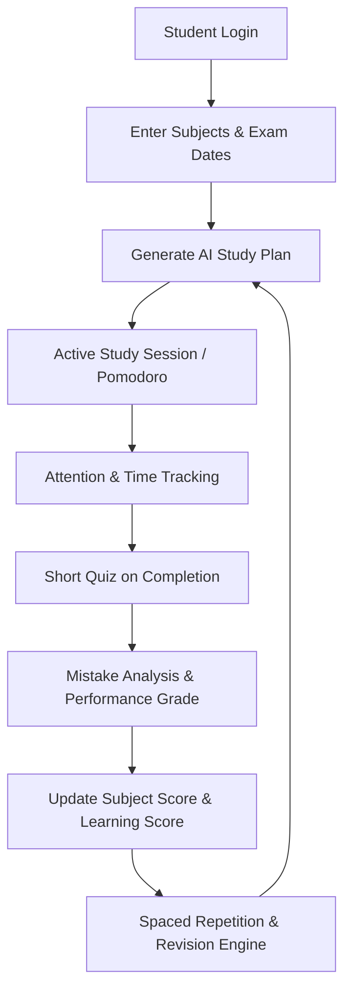

# 🌌 Vortex: Adaptive Study Planner

> **"Students solving their own suffering through technology."**
> Vortex is an AI-powered, neuromorphic study planner designed to eliminate student burnout and optimize learning efficiency. Instead of rigid, static timetables that lead to guilt and fatigue, Vortex creates a fluid, dynamic study schedule that adapts in real-time to the student's actual cognitive state, performance, and attention span.

---

## problem statement 

Adaptive Study Planner Based on Learning Patterns
Create a system that adjusts study recommendations based on attention span, mistakes, and revision habits. Students solving their own suffering through technology


## 🧠 The Neuromorphic Philosophy & Concept

Vortex applies **Neuromorphism**—systems inspired by the structure and function of the human brain—across two critical dimensions:

1. **Algorithmic (Brain-Inspired AI)**: The recommendation engine calculates a **Priority Score** for study topics using formulas that mimic synaptic plasticity and memory decay curves. Just as neural pathways strengthen with repetition and fade with disuse, Vortex spikes a topic's priority when a student struggles on a quiz, and decays the priority (spacing it out) as they demonstrate mastery.
2. **Aesthetic Design (Neumorphic UI)**: The frontend uses a soft, fluid glassmorphism and ambient glow design. This reduces visual noise and cognitive load, creating a calming study environment that actively combats the stress and anxiety usually associated with traditional planners.

---

## 🔄 System Architecture & Data Flow

Vortex works by continuously analyzing student interaction data to modify scheduling and recommendations. Below is the conceptual flow of the application:



---

## 🌟 Key Features

### 📅 1. Dynamic AI Study Planner
*   **Fluid Schedules**: No more "dumb calendars" where missing a day breaks the whole week. If you miss a session, Vortex silently reshapes the upcoming schedule without guilt-inducing alerts.
*   **Priority Scores**: Calculates priority for every subject based on:
    $$\text{Priority Score} = 0.5 \times \text{Mistake Rate} + 0.3 \times \min(\text{Days Since Revision}, 30) + 0.2 \times \text{Exam Weight}$$
*   **Time Allocation**: Automatically assigns study blocks of **90 minutes** (High Priority), **60 minutes** (Medium Priority), or **30 minutes** (Low Priority).

### ⏱️ 2. Pomodoro & Attention Tracker
*   **Active Focus Ring**: Integrated visual SVG timer for Pomodoro focus periods.
*   **Time-to-Expected-Time Ratio**: Analyzes your actual time spent per question on quizzes against expected times.
*   **Cognitive Analysis**:
    *   *Slow Correct*: Understands the material but needs practice.
    *   *Slow Wrong*: High-priority review required.
    *   *Fast Wrong*: Rushing issues—needs to slow down.
    *   *Mastered*: Balanced speed and accuracy.

### 📝 3. Quiz Mode & Mistake Analysis
*   Engage in targeted topic testing immediately following a study session.
*   The results are processed through the backend engine to identify weak areas and feed back into the priority calculator.

### 📅 4. Spaced Repetition (Revision Engine)
*   Implements an adaptive interval scale to schedule reviews right before forgetting sets in:
    *   **Revision 1**: +1 Day
    *   **Revision 2**: +3 Days
    *   **Revision 3**: +7 Days
    *   **Revision 4**: +15 Days
    *   **Revision 5+**: +30 Days

### 📊 5. Progress Center & Analytics
*   Tracks XP (experience points) earned from correct answers.
*   Provides streak counting to build healthy study habits.
*   Displays study duration curves and subject mastery levels.

---

## 📂 Project Structure

```text
Vortex/
├── ai_models/                  # Brain core (AI modeling & calculations)
│   ├── __init__.py
│   ├── learning_score.py       # Computes overall student learning scores
│   ├── priority_calculator.py  # Algorithms for subject priority levels
│   └── scheduler.py            # Generates daily schedule from subject metadata
│
├── backend/                    # Python API Server
│   ├── database/
│   │   └── studyplanner.db     # SQLite Database (auto-generated)
│   ├── app.py                  # Flask REST API Controller
│   ├── attention_tracker.py    # Focus analyzer from quiz speeds
│   ├── database.py             # Database creation & queries
│   ├── planner.py              # Session & study plan helpers
│   ├── quiz_engine.py          # Grading and analysis backend
│   ├── recommendation_engine.py# Personal suggestions & exam readiness
│   └── revision_engine.py      # Spaced repetition scheduler
│
├── frontend/                   # Vanilla web client
│   ├── css/
│   │   └── style.css           # Custom glassmorphic styling
│   ├── js/
│   │   ├── main.js
│   │   ├── dashboard.js
│   │   ├── planner.js
│   │   ├── quiz.js
│   │   └── charts.js           # Chart.js visualization logic
│   ├── index.html              # Landing & Login
│   ├── dashboard.html          # Main student console
│   ├── planner.html            # AI schedule view
│   ├── quiz.html               # Interactive assessments
│   ├── subjects.html           # Subject manager
│   └── progress.html           # Historical analytics dashboard
│
├── run.py                      # One-command unified launcher
├── requirement.txt             # Python dependencies
└── readme.md                   # Project documentation
```

---

## 🚀 Getting Started & Setup

### Prerequisites
*   Python 3.8 or higher installed on your system.

### 1. Install Dependencies
Navigate to the project root directory and run:
```bash
pip install -r requirement.txt
```
*(Dependencies: Flask, Flask-Cors)*

### 2. Start the Application
Simply run the one-command launcher:
```bash
python run.py
```
This script will:
1. Initialize the SQLite database (`studyplanner.db`) if it doesn't already exist.
2. Start the **Flask API Backend** on **`http://localhost:5000`**.
3. Spin up the **Frontend Web Server** on **`http://localhost:8080`**.

### 3. Open in Browser
Once both servers are online, visit:
👉 **`http://localhost:8080`**

---

## 🛠️ Alternative Launch Workarounds

If `run.py` fails to launch both processes simultaneously, use the following manual commands:

#### Option A: Manual Terminal Splits
*   **Terminal 1 (Backend API)**:
    ```bash
    python backend/app.py
    ```
*   **Terminal 2 (Frontend UI)**:
    ```bash
    python -m http.server 8080 --directory frontend
    ```

#### Option B: Live Server Extension (VS Code)
1. Run `python backend/app.py` in your terminal.
2. Open `frontend/index.html` in VS Code, right-click, and select **"Open with Live Server"** (usually runs on port 5500). Ensure the frontend matches the API endpoints accordingly.